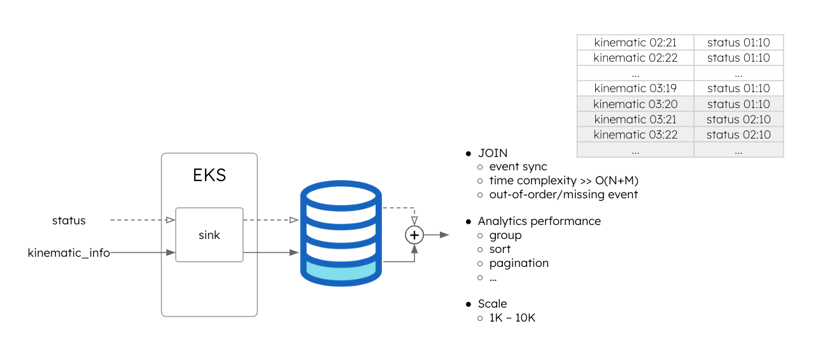
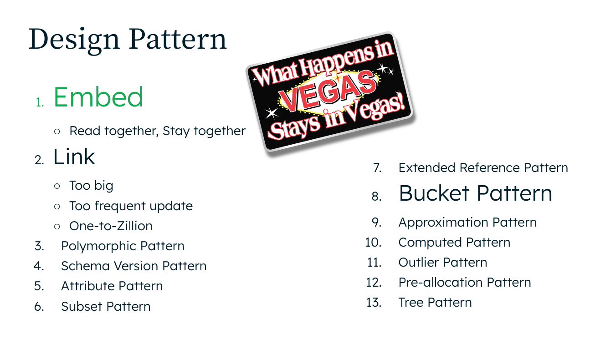
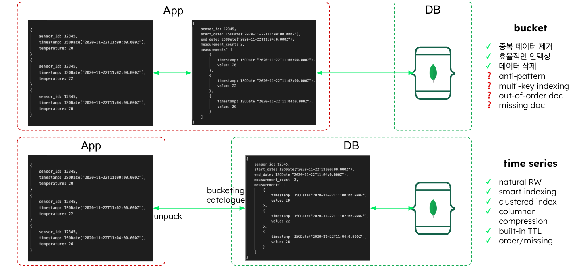
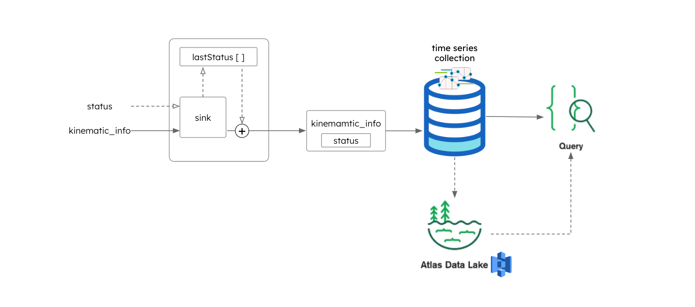
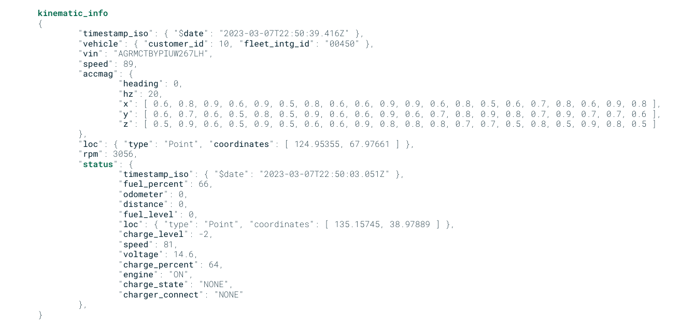
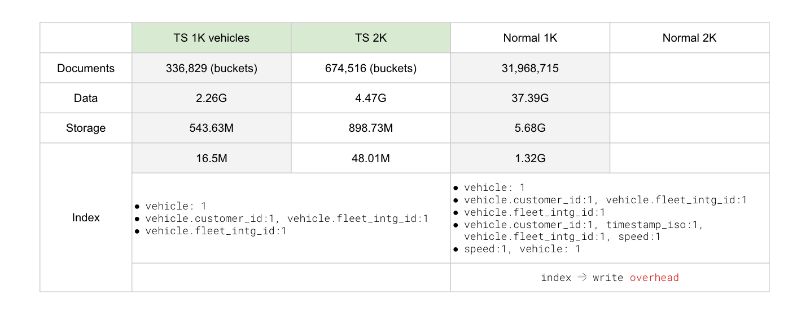
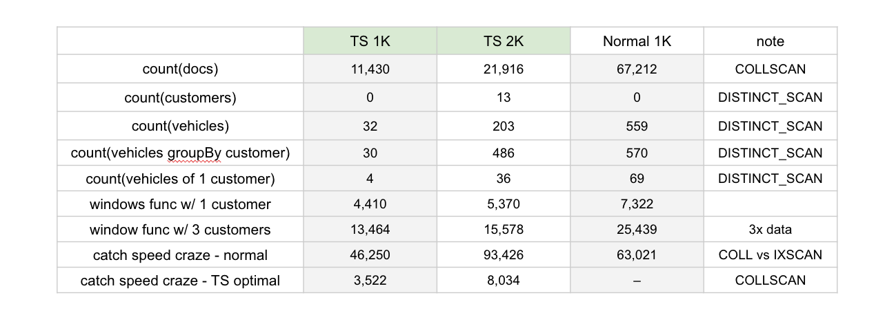

# FMS Event Processor based on MongoDB Time Series Collection

[&rarr; Overview &amp; Problem](#overview)  
[&rarr; Solution](#solution)  
[&rarr; Usage](#usage)  
[&rarr; Sizing](#sizing)  
[&rarr; Query Samples](#query-samples)  
[&rarr; Conclusion](#conclusion)

<br>

## Overview

> **FMS** : Fleet Management System

It's an emulator to handle vehicle IoT events which are characterized by

- `status` event: represents engine's start/stop
- `kinematic` event: represents vehicle's movement during drive

Each event can be represented by [json documents](./template.js)  
and has frequency of

- `status` / minute once the engine started - `engine:[ON, OFF]`
- `kinematic` / second while a car is in motion - `speed:(0, MAX)`

Eventually, two events should be joined before consumption.  
However for such scale as 1K~10K vehicles(event source), it's a foregone conclusion that `JOIN` is not capable of the time complexity.



- `JOIN` issue
  > - There's time difference between `engine:ON` and `vehicle:MOVE`
  > - `kinematic` events of one time group(`HH:03:SS`) straddle two time spans of `status` events(`HH:01:SS` ~ `HH:02:SS`)
  > - Simple `JOIN` cannot work on `timestamp` resulting in `O(JOIN) >> O(N+M)`  
  >   (actually, `O(N+M)` itself is prohibitively expensive for large scale systems)
  > - Furthermore, out-of-order / missing events are inevitable, which will aggrevate the situation.
- Analytics
  > - Time complxity for large scale data
  > - Patience cannot be a solution  
  >   (Since when, **StarWars** has become one of the world's best sucks!!)


<br>

## Solution

### Document Model - Embed



**Embedding** is the principle #1 for document modeling  
and the best fit for data such as IoT events characterized by

- static (insert &amp; no post-update)
- relatively small documents

<br>

### Time Series Collection



MongoDB introduced a purpose-built [`Time Series`](https://www.mongodb.com/blog/tags/time-series) collection from v5.0 onward.  
Actually, `Bucket Pattern` has long been honored to be the King of IoT data with its own limitations leaving developers with no better option.

Simply put, `Time Series` is a fully-managed `Bucket Pattern` if you will (rather technically, a super smart writeable view backed by internal buckets), with dramatic optimization internally that applications can't ever implement on its own.

Most of all, we're all descendants of T-Rex, huh?


<br>

### Architecture



1. `Embed`
1. Store `"kinematic_info{ status{} }"` to `Time Series` collection
1. Optionally, deploy `Data Tiering` for cold data management along with [`Federated Query`](https://www.mongodb.com/docs/atlas/data-federation/overview/)  
   (time-series data tend to amass quickly and go stale at the same time but need be available once in a while)

<br>

## Usage

It's ultimately a document generator and feeder that emulates an event sink to store data of the IoT system.

What it does is

- receive events; `stats` and `kinematic`
- join(rather, embed) `status` into `kinematic`
- store json documents to [`Atlas`](https://www.mongodb.com/atlas/database) or dump bson to a file

**Sample json doc generated**



- 100 vehicles / customer
- `customer_id`: [1, N<sub>C</sub>]
- `fleet_intg_id`: [1, N<sub>F</sub>]

<br>

### prep

- copy `env` and rename to `.env`
- set `ATLAS_CONN_URI`
- run `npm install`

<br>

### online mode

- check out the branch, `inserMany`
- usage
  > `node evsource.js [-cb]`
  >
  > - `c`: drop the target collection, `kinematic_info` in **Atlas** before uploading
  > - `b`: generate big data set (2,000 vehicles, 1,000 without `b`)
  >   > target `db` is `fmsk` without `b`  
  >   > target `db` is `fms10k` with `b`

> Takes around 30 min to generate and upload 100K documents

<br>

### offline mode

- check out the branch, `main`
- usage
  > `node evsource.js [-cbf <bson_dump_file_path>]`
  >
  > - `c`: drop the target collection, `kinematic_info` in **Atlas** before generating
  > - `b`: generate big data set (2,000 vehicles, 1,000 without `b`)
  > - `f <bson_dump_file_path>`: a file path to dump bson documents to

Once done with generation, the bson file can be uploaded to **Atlas** via [`mongorestore`](https://www.mongodb.com/docs/database-tools/mongorestore/#mongorestore).

> `mongorestore --uri <ATLAS_CONN_URI> -d <target db> -c <target collection> [--drop] <bson_dump_file_path>`

<br>

## Sizing



> > > `TS 1K`: Time Series collection of 1K vehicle data set  
> > > `TS 2K`: Time Series collection of 2K vehicle data set  
> > > `Normal 1K`: Regular collection of 1K vehicle data set  
> > > `Normal 2K`: No need to bother with 2K normal collection. It's too self-evident that regular collections can't compare as we scale up for time-series data (check [Query Test result](#test-outcome) for details)

- While users see the total number of documents through `Time Series`, the internal collection maintains a lot fewer buckets than the actual documents, which directly translates to **performance boost** combined with smart indexing
- Not only `Wired-Tiger` compression, `Time Series` compresses data columns in an optimal way for each data type, which leads to less than a tenth of storage size  
  Less storage means **smaller disk**, **little backup**, and **littel disk IO**. All must help save cost both in finance and performance
- Whereas regular collections require separate indexes to optimize specific queries, `Time Series` can handle more queries with less index, usually for meta and time fields only.  
  It in turn translates to littel write-overhead caused by indexes. Take int the nature of IoT events and you won't miss one of the many values that `Time Series` bring to your applications.

<br>

## Query Samples

The repository comes with [test queries](./vsc-playground) that provides sense of how `Time Series` comapres with regular collections.

> tests are `VS Code` [`MongoDB Playground`](https://www.mongodb.com/docs/mongodb-vscode/playgrounds/) files

- `doc-count.mongodb`

  > count(docs): check `COLLSCAN` performance

  <br>

- `customer-count.mongodb`

  > count(customers): check `DISTINCT_SCAN` and meta index performance

  <br>

- `fleet-count.mongodb`

  > count(vehicles): check `DISTINCT_SCAN` and meta index performance

  <br>

- `fleet-countby-customer.mongodb`

  > count(vehicles groupBy customer): check `DISTINCT_SCAN`, meta index, and `$group` performance

  <br>

- `fleet-countby-onecustomer.mongodb`

  > count(vehicles groupBy customer): check `DISTINCT_SCAN`, meta index, and `$group` performance

  <br>

- `avg-speed-pervehicle-bycustomer-1c.mongodb`

  > windows func w/1 customer: check window function performance with `Time Series` collection

  <br>

- `avg-speed-pervehicle-bycustomer-3c.mongodb`

  > windows func w/3 customer: check how window function performs with sacle (3x more data to process)

  <br>

- `speedcraze-max.reg.mongodb`

  > catch speed craze - normal: check how `Time Series` collection compare with regular aggregation pipeline

  <br>

- `speedcraze-max.ts-optimal.mongodb`

  > catch speed craze - TS optimal: check how `Time Series` collection compare with time-series optimized query

  <br>

### Test Outcome



> > > Time is measured in `ms` through [`explain()`](https://www.mongodb.com/docs/manual/reference/command/explain/#explain)  
> > > `TS 1K`: Time Series collection of 1K vehicle data set  
> > > `TS 2K`: Time Series collection of 2K vehicle data set  
> > > `Normal 1K`: Regular collection of 1K vehicle data set

I won't walk you through the boring details.  
In general, `Time Series` always shows decently better performance than regular collections. Needless to say, it's purposely built for time-series data if I didn't say before.  
Indeed, even 2K data set `TS` outperforms 1K regular collections even with less indexes (only for meta and time fields). It creates a virtuous cycle where fewer indexes helps IO performance with fewer writes that in turn allows applications for more writes. It comes off as a big advantage especially when it comes to IoT data characterized by mass writes.

There out stand two queries as you must've already noticed.

- `catch speed craze - normal`
- `catch speed craze - TS optimal`

The former is an oridnary [aggregation pipeline](https://www.mongodb.com/docs/manual/aggregation/#aggregation-operations) you'd expect of regular collections.

```
    const aggregation = [
      {
        $match: {
          speed: {
            $gt: 130
          }
        }
      },
      {
        $group: {
          _id: '$vehicle',
          max: {
            $max: '$speed'
          }
        }
      },
    ];
```

- filter out vehicles that logged speed over 130 km/h
- among them, find out the maximum speed they reached per each vehicle

It's a very well-written pipeline in that the query first drops off unnecessary data with `$match` stage to proceed to the next.  
Although `TS` can handle it without special index through `COLLSCAN` whereas the regular collection needed a compound index on `{speed, vehicle}` to optimize the query to filter out data and avoid `FETCH` (a covered query), `TS` shows a humble better performance,a petty ~17 sec compared with other queries.

Actually, this query does not do the justice to `Time Series`.

Look this version of the same query.

```
    const aggregation = [
      {
        $group: {
          _id: '$vehicle',
          max: {
            $max: '$speed'
          }
        }
      },
      {
        $match: {
          max: {
            $gt: 130
          }
        }
      }
    ];
```

`WT*`  
You say?  
You're right. It's weird, if not for a pervert. Never try it on regular collections. Whatever index you create for optimization, the engine will run a `COLLSCAN`, more precisely a [slot-based execution](https://www.mongodb.com/docs/manual/core/aggregation-pipeline-optimization/#-group-optimization). (You can enforce `IXSCAN` with [`hint`](https://www.mongodb.com/docs/manual/reference/command/aggregate/#hint-an-index) but after all the result is the same as the ordinary query that is also an index scan)

As you can see, this query shows a dramatical drop in time - **3,522 vs 63,021**. Yes, you're seeing the right figure, a twentieth of execution time even with `COLLSCAN`.  
It's the culmination of hidden techniques under the hood that do all the heavy lifting for developers - bucketing, smart indexing, control field as well as meta and time field.

**How does this work?**

`TS` bucket consists of

- `timeField`
- `metaField`
- `control` field
- `data` field

Especially , `control` field maintains metadata for the bucket.  
One of them is the bucket's min &amp; max values.  
That's the key to this query.

1. scan buckets(documents)
1. check `max` of `speed` of each bucket
1. filter out documents over `130 km/h`

As we know now, `TS` manages a lot fewer buckets than actual documents and because it need not check individual bucket element thanks to the `max` in the `control` field.

Tada~

<br>

## Conclusion

We proved that `Time Series` collection does serve the purpose of the architect.  
And when combined with flexible document model, it must play a key role in the target domain without a doubt.
